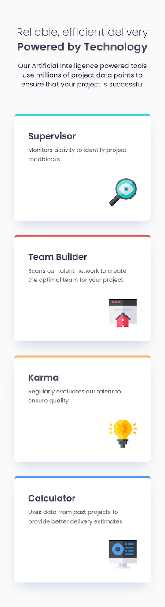
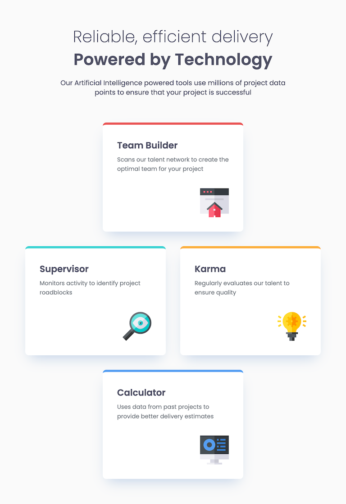
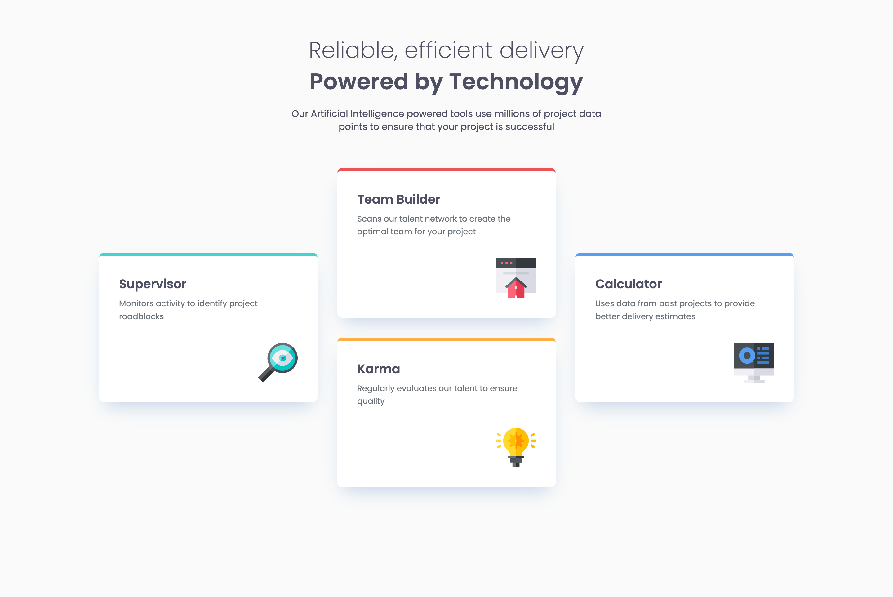

# Frontend Mentor - Four card feature section solution

This is a solution to the [Four card feature section challenge on Frontend Mentor](https://www.frontendmentor.io/challenges/four-card-feature-section-weK1eFYK). Frontend Mentor challenges help you improve your coding skills by building realistic projects.

## Table of contents

- [Frontend Mentor - Four card feature section solution](#frontend-mentor---four-card-feature-section-solution)
  - [Table of contents](#table-of-contents)
  - [Overview](#overview)
    - [The challenge](#the-challenge)
    - [Screenshot](#screenshot)
    - [Links](#links)
  - [My process](#my-process)
    - [Built with](#built-with)
    - [What I learned](#what-i-learned)
    - [Continued development](#continued-development)
    - [Useful resources](#useful-resources)
    - [AI Collaboration](#ai-collaboration)
  - [Author](#author)

## Overview

### The challenge

Users should be able to:

- View the optimal layout for the site depending on their device's screen size

### Screenshot







### Links

- Solution URL: [https://github.com/chiaminchen/four-card-feature-section](https://github.com/chiaminchen/four-card-feature-section)
- Live Site URL: [https://four-card-feature-section-zeta-sage.vercel.app/](https://four-card-feature-section-zeta-sage.vercel.app/)

## My process

### Built with

- Semantic HTML5 markup
- CSS custom properties
- Flexbox
- CSS Grid
- Mobile-first workflow
- [React](https://reactjs.org/) - JS library
- [Vite](https://vitejs.dev/) - Build tool
- CSS Modules

### What I learned

This project was a great opportunity to practice my CSS Grid and React skills. One of the most important things I learned was how to balance semantic HTML (Accessibility) with CSS layout techniques.

When I added an `<h2>` heading with a `.sr-only` class for screen readers inside my `<section>`, my CSS Grid layout broke because my CSS was using `:nth-child()`. I learned to use `:nth-of-type()` to target specific elements (`<article>`) without disrupting the layout when accessibility elements are added:

```css
/* Targeting specific elements instead of just children index */
.features > article:nth-of-type(1) {
  grid-column: 1 / 3;
  grid-row: 2 / 3;
}
```

I also learned how to avoid inline styles in React components by using HTML `data-*` attributes combined with CSS Modules. This keeps the React component clean and transfers all styling responsibilities back to CSS:

```jsx
<article className={styles.featureCard} data-color={color}>
  {/* Component content */}
</article>
```

```css
.featureCard[data-color='success'] {
  border-top: 5px solid var(--color-success);
}
```

### Continued development

In future projects, I want to focus more on:

- **TypeScript**: Using TypeScript to define interfaces for my component props instead of relying on pure JavaScript, which will provide better developer experience and robustness.
- **Testing**: Incorporating tools like Vitest and React Testing Library to write unit and component tests.
- **Accessibility**: Continuing to learn about WAI-ARIA standards and ensuring all my interactive components are fully accessible.

### Useful resources

- [WebAIM: Invisible Content Just for Screen Reader Users](https://webaim.org/techniques/css/invisiblecontent/) - This article helped me understand how to visually hide elements (like section headings) while keeping them accessible to screen readers using the `.sr-only` class.

### AI Collaboration

- **Tools used:** Antigravity (Gemini 3.1 Pro)
- **How I used it:** I used the AI for a professional code review to identify blind spots in my code, specifically focusing on Accessibility, Code Quality, and CSS Architecture.
- **What worked well:** The AI caught a missing heading in my `<section>` tag which was an accessibility issue. It also provided a great architectural suggestion to replace inline styles with `data-*` attributes. Most importantly, when my CSS Grid layout broke after adding the screen-reader heading, the AI quickly identified that the `:nth-child()` selector was the culprit and taught me how to use `:nth-of-type()` to fix the grid layout perfectly.

## Author

- Frontend Mentor - [@chiaminchen](https://www.frontendmentor.io/profile/chiaminchen)
- Github - [@chiaminchen](https://github.com/chiaminchen)
